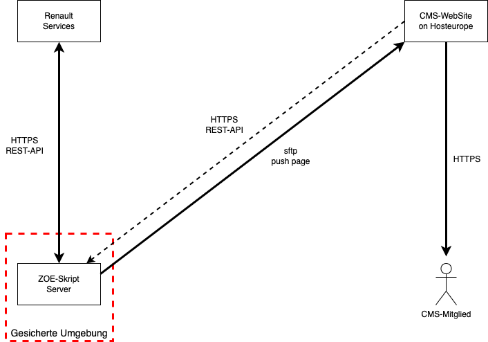

# Architektuüberblick ZOE Status Skript
:author: Mischa Soujon
:email: mischa@soujon-net.de
:date: 2023-01-19 18:07:44
:toc:

## Bereitstellen der ZOE Status auf der CMS Web-Seite

Renault stellt mit den "Renault Services" eine REST-API (https://renault-api.readthedocs.io/en/latest/usage.html) für jeden ZOE Besitzer zur Verfügung. Über diese API können fast alle Status-Informationen über den Kunden, das Kundenkonto und die Fahrzeuge zum Konto eingesehen und teilweise verändert werden. Die API stellt nicht alle Funktionen der Renault Web-Oberfläche bzw. der MobilApp zur Verfügung, aber die hilfreichen, um beispielsweise Ladezustand und Standort von unseren ZOEs abzufragen.

Das link:https://www.goingelectric.de/forum/viewtopic.php?f=57&t=58182[PHP-Skript] von https://www.goingelectric.de kann mit den entsprechenden Zugangsdaten die "Renault Services" abfragen und dann seinerseits nur die notwendigen Informationen für weitere Nutzer bereitstellen. Das kann das Skript durch aktives Kopieren (sftp) auf die CMS-WebSeite erfolgen.

Auf diese Weise bleiben alle Zugangsdaten auf dem Server auf dem das Skript läuft und für die Nutzer der CMS-WebSeite die "Renault Services" gar nicht sichtbar werden.

## Daten

batteryLevel ist in prozent
batteryAvailableEnergy ist in kWh
batteryAutonomy ist die Geschätzte Reichweite in km

### Total RESULT
{
  "vehicle": {
    "id": 26,
    "name": "Zoe 2 ROTKREUZSTR.",
    "plate": "EBE-CU 89E",
    "caretaker": "Torsten Hauberg",
    "email": "torsten.hauberg@t-online.de",
    "phone": "+49 812 1404 21",
    "zoeph": 2,
    "vin": "VF1AG000268925498",
    "countryOfRegistration": "DE"
  },
  "battery": {
    "id": "VF1AG000268925498",
    "timestamp": "2023-01-23T13:17:25Z",
    "batteryLevel": 16,
    "batteryTemperature": 20,
    "batteryAutonomy": 43,
    "batteryCapacity": 0,
    "batteryAvailableEnergy": 9,
    "plugStatus": 0,
    "chargingStatus": 0,
    "chargingRemainingTime": 10,
    "chargingInstantaneousPower": 0
  },
  "cockpit": {
    "id": "VF1AG000268925498",
    "fuelQuantity": 0,
    "totalMileage": 7086,
    "fuelAutonomy": 0
  },
  "chargeMode": {
    "id": "VF1AG000268925498",
    "chargeMode": "always"
  },
  "outside": {
    "id": "VF1AG000268925498",
    "socThreshold": 20,
    "lastUpdateTime": "2023-01-23T11:31:07Z",
    "hvacStatus": "off"
  },
  "location": {
    "id": "VF1AG000268925498",
    "gpsLatitude": 48.19476968,
    "gpsLongitude": 11.86444616,
    "lastUpdateTime": "2023-01-23T13:17:07Z",
    "gpsDirection": null
  }
}